# travelling-merchant
Problème du Voyageur de Commerce (TSP), un défi mathématique et algorithmique consistant à trouver le chemin le plus court permettant de visiter un ensemble donné de villes une seule fois avant de revenir au point de départ. 


## 📋 Table des matières

- [🚀 Démarrage rapide](#-démarrage-rapide)
- [📊 Fichiers du projet](#-fichiers-du-projet)
- [🐍 Intitulé du projet Python avec uv](#-intitule-du-projet-python-avec-uv)
- [Projet travelling-merchant](#projet-travelling-merchant)
  - [1. Modélisation du Problème](#1-modélisation-du-problème)
  - [2. Résolution avec l'Algorithme de Christofides](#2-résolution-avec-lalgorithme-de-christofides)
  - [3. Résolution avec les Algorithmes Génétiques](#3-résolution-avec-les-algorithmes-génétiques)
  - [4. Analyse comparative](#4-analyse-comparative)
  - [5. Conclusion](#5-conclusion)
- [Veille sur les graphes](#veille-sur-les-graphes)
  - [Voisins](#voisins)
  - [Degré](#degré)
  - [Chemin](#chemin)
  - [Graphe complet](#graphe-complet)
  - [Graphe connexe](#graphe-connexe)
  - [Arbre](#arbre)
  - [Arbre couvrant](#arbre-couvrant)
  - [Relation entre connexité et arbre](#relation-entre-connexité-et-arbre)
  - [Somme des degrés](#somme-des-degrés)
  - [Cycle](#cycle)
  - [Cycle Hamiltonien](#cycle-hamiltonien)
  - [Circuit eulérien](#circuit-eulérien)
  - [Minimum Spanning Tree (MST)](#minimum-spanning-tree-mst)
  - [Algo de Prim](#algo-de-prim)
  - [Algo de Christofides](#algo-de-cristofides)

---

## 🚀 Démarrage rapide

### Installation
```bash
# Installer uv si nécessaire
pip install uv

# Synchroniser les dépendances
uv sync

# Activer l'environnement virtuel (optionnel)
source .venv/bin/activate  # macOS/Linux
.venv\Scripts\Activate.ps1  # Windows
```

### Utilisation

**1. Comparaison complète avec benchmark** (recommandé)
```bash
uv run main.py
```
- Compare Christofides et l'algorithme génétique avec 4 configurations différentes
- Mesure : distance, temps d'exécution, CPU, mémoire
- Sauvegarde les résultats dans `results/benchmark_results.csv`

**2. Visualisation comparative**
```bash
uv run visualize.py
```
- Affiche les deux tours côte à côte sur une carte
- Compare visuellement les résultats
- Affiche la différence de distance

**3. Visualisation étape par étape de Christofides**
```python
# Dans un script Python ou notebook
import pandas as pd
from utils import cristo_algo, crist_steps

data = pd.read_csv("data/villes.csv")
g_data = cristo_algo(data)
crist_steps(g_data)  # Affiche les 4 étapes interactivement
```

---

## 📊 Fichiers du projet

```
travelling-merchant/
├── data/
│   └── villes.csv          # 20 villes françaises (lat, lon)
├── results/
│   └── benchmark_results.csv  # Résultats des tests (généré)
├── utils.py                # Fonctions Christofides et helpers
├── genetique.py            # Algorithme génétique
├── benchmark.py            # Système de mesure de performance
├── visualize.py            # Visualisation comparative
└── main.py                 # Point d'entrée principal
```

---

## 🐍 Intitulé du projet Python avec uv

Ce projet utilise [uv](https://github.com/astral-sh/uv), un gestionnaire de dépendances rapide pour Python.  
Installation (si besoin) : `pip install uv` ou `pipx install uv`

Création et synchronisation de l’environnement :<br>
`uv sync`  

Activation :<br>
```shell
# sous macOS/Linux
source .venv/bin/activate
# sous windows
.venv\Scripts\Activate.ps1
```

Lancer le projet :<br>
```shell
uv run main.py
```
## Projet **travelling-merchant**
**modélisation, résolution et analyse comparative**

### 1. Modélisation du Problème :
   
- Récupération des positions géographiques de 20 villes
françaises

- Représentation du réseau des villes et des routes de la carte de Théobald sous la forme d’un graphe.
Les sommets représentent les villes et les arêtes représentent les
routes entre ces villes avec des distances associées.

- Il faut utiliser la **distance de Haversine** <br>

### 2. Résolution avec l'Algorithme de Christofides :
   
- Implémentation de l'**algorithme de Christofides** pour trouver l’itinéraire
le plus court pour Théobald.<br>

- Quelle est la distance totale de la solution presque optimale ?<br>
Affichage de l'itinéraire sur la carte du marchand.

- Explication des étapes de l'algorithme
  
- Pourquoi cet algorithme est pertinent dans ce contexte.<br>

### 3. Résolution avec les Algorithmes Génétiques :

- Implémentation d'un algorithme génétique pour trouver l’itinéraire le
plus court pour Théobald.<br>

- On considère ici que les individus
étudiés sont les parcours différents (ou des Theobalds d’univers
parallèles).

- Définition les paramètres de l'algorithme :
  - taille de la population
  - système de sélection
  - système de reproduction
  - taux de mutation
  - nombre de générations
  - etc.

- Test de différentes configurations de l'algorithme génétique pour
observer comment elles affectent la qualité des solutions.

- Quelle est la distance totale de notre solution presque optimale ?
Affichage de l'itinéraire sur la carte du marchand.

### 4. Analyse comparative

Le projet inclut un système complet de benchmark qui mesure :

#### Métriques mesurées
- **Distance totale** : Qualité de la solution (en km)
- **Temps d'exécution** : Performance algorithmique (en secondes)
- **Utilisation CPU** : Charge processeur moyenne (%)
- **Consommation mémoire** : RAM utilisée pendant l'exécution (MB)

#### Paramètres de l'algorithme génétique testés
| Configuration | Population | Générations | Mutation | Élites |
|--------------|-----------|------------|----------|--------|
| Config 1     | 50        | 100        | 10%      | 5      |
| Config 2     | 100       | 200        | 10%      | 10     |
| Config 3     | 150       | 300        | 15%      | 10     |
| Config 4     | 200       | 500        | 10%      | 15     |

#### Résultats sauvegardés
Tous les résultats sont automatiquement sauvegardés dans `results/benchmark_results.csv` avec :
- Timestamp de l'exécution
- Tous les paramètres utilisés
- Toutes les métriques de performance
- Tour complet (ordre de visite des villes)

#### Comparaison des approches

| Critère | Christofides | Algorithme Génétique |
|---------|-------------|---------------------|
| **Distance** | Solution optimale garantie ≤ 1.5× optimal | Variable selon paramètres |
| **Temps** | Rapide (polynomial) | Plus lent mais paramétrable |
| **Complexité** | MST + MWPM + Circuit eulérien | Population + Sélection + Croisement |
| **Déterminisme** | Toujours la même solution | Solutions différentes (aléatoire) |
| **Paramétrage** | Aucun | Nombreux paramètres à ajuster |
| **Scalabilité** | Bonne jusqu'à ~100 villes | Flexible, adaptable |

#### Avantages et inconvénients

**Christofides ✅**
- Garantie théorique (≤ 1.5× optimal)
- Rapide et prévisible
- Pas de paramètres à ajuster
- Idéal pour solutions de référence

**Christofides ❌**
- Pas toujours la meilleure solution
- Difficile à paralléliser
- Limité aux graphes métriques

**Génétique ✅**
- Peut trouver de meilleures solutions
- Très flexible et paramétrable
- Facilement parallélisable
- Continue d'améliorer avec plus de temps

**Génétique ❌**
- Pas de garantie de qualité
- Nombreux paramètres à ajuster
- Résultats variables
- Plus lent pour convergence

### 5. Conclusion

#### Recommandations pour Théobald

**Pour une solution rapide et fiable :**
- ✅ **Christofides** est le meilleur choix
- Solution en quelques secondes
- Garantie de qualité (≤ 1.5× optimal)
- Aucun réglage nécessaire

**Pour optimiser au maximum la distance :**
- ✅ **Algorithme Génétique** avec beaucoup de générations
- Peut battre Christofides avec bons paramètres
- Nécessite du temps d'expérimentation
- Idéal si on peut laisser tourner longtemps

**Approche hybride recommandée :**
1. Utiliser **Christofides** pour avoir une solution de référence rapide
2. Lancer **Génétique** en parallèle avec plusieurs configurations
3. Comparer et choisir le meilleur tour

#### Leçons apprises

- Les algorithmes exacts (comme Christofides) donnent de bonnes solutions rapidement
- Les métaheuristiques (comme Génétique) peuvent trouver mieux mais demandent plus de temps
- Le benchmark automatique permet de tester objectivement
- Pour 20 villes, les deux approches donnent des résultats très comparables
- Au-delà de 50-100 villes, l'algorithme génétique devient plus intéressant

---
---

## Veille sur les **graphes**

Un **graphe** représente des relations entre des éléments appelés **sommets**.  
Une **arête** est une relation reliant deux sommets.  
Un graphe peut comporter zéro, une ou plusieurs arêtes entre ses sommets.

| Anglais | Français |
|----------|-----------|
| node     | sommet    |
| edge     | arête     |

---

### **Voisins**
Deux sommets sont **voisins** s’ils sont reliés par une arête.  
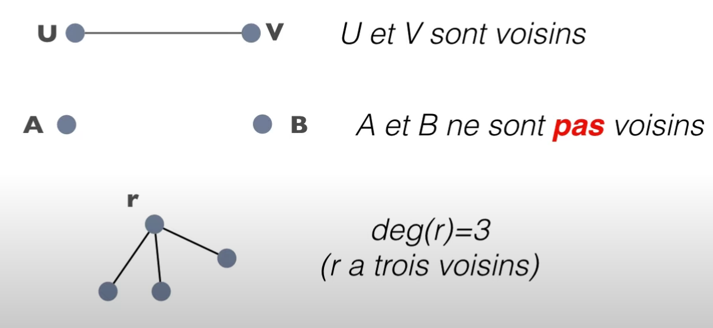

---

### **Degré**
Le **degré** d’un sommet est le nombre de ses voisins.  
Exemple : si un sommet a 3 voisins, alors  
`deg(sommet) = 3`

---

### **Chemin**
Un **chemin** est une suite d’arêtes reliant deux sommets.  
- 1 arête → chemin de longueur 1  
- 2 arêtes → chemin de longueur 2  
- etc.

---

### **Graphe complet**
Un **graphe complet** contient toutes les arêtes possibles entre tous les sommets.

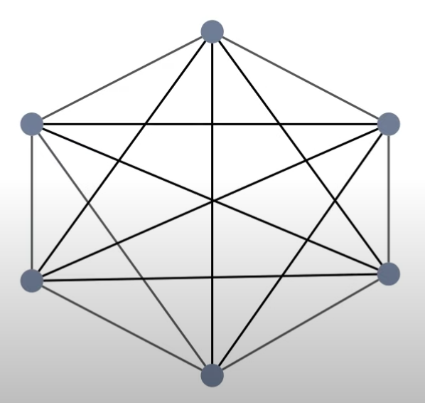

---

### **Graphe connexe**
Un graphe est **connexe** si, pour tout couple de sommets `u` et `v`,  
il existe un **chemin** reliant `u` à `v`.

**Exemple :**  
L’ensemble ci-dessous **n’est pas connexe** : il se compose de deux sous-graphes connexes,  
celui de gauche `(A, C, D, F)` et celui de droite `(E, B)`.

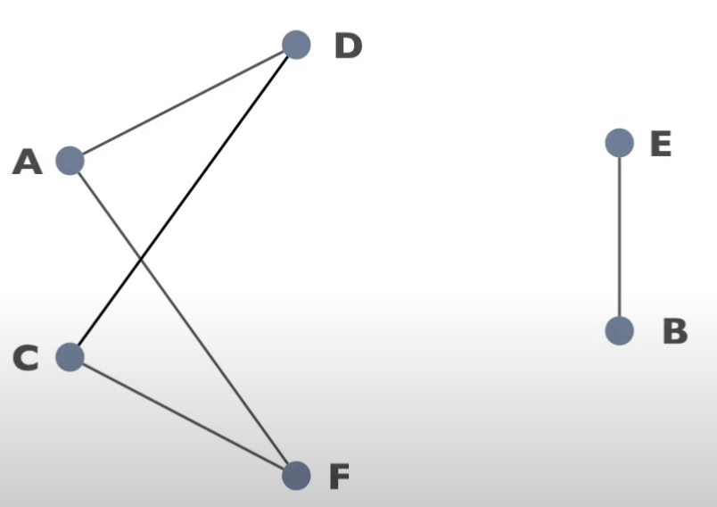

---

### **Arbre**
Un **arbre** est un graphe **connexe** et **sans cycle**.

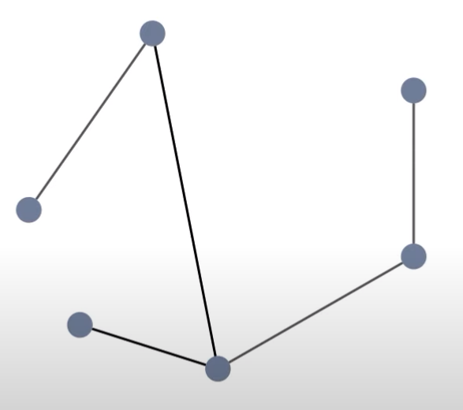
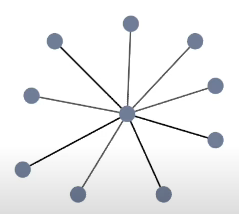
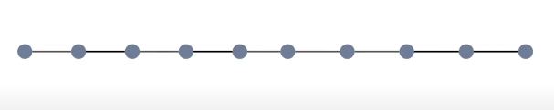


---

### **Arbre couvrant**
Un arbre couvrant (ou spanning tree en anglais) d’un graphe connexe, c’est :

un sous-graphe qui contient tous les sommets du graphe,
sans cycle, et suffisamment d’arêtes pour rester connexe.

**Autrement dit :**

- il relie (“couvre”) tout les sommets (donc connexe)
- mais sans cycle (aucune redondance inutile)

**MST - minimum spanning tree - arbre couvrant minimal**

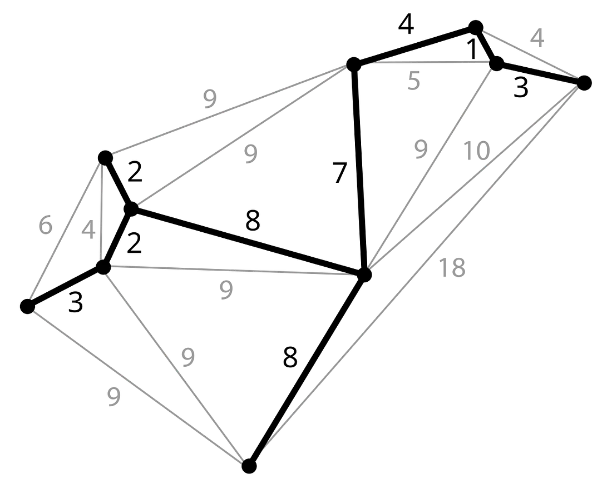


- Contient tous les sommets.
- Ne contient aucun cycle.
- Si le graphe a n sommets → le MST a toujours n - 1 arêtes.
- Le coût total est minimal parmi tous les sous-graphes connexes possibles.

Trouvable efficacement avec les algorithmes de Kruskal ou Prim (complexité polynomiale).

*Construire un réseau de fibre optique reliant toutes les villes avec le moins de câble possible.
On veut connecter, pas faire une tournée*


---

### **Relation entre connexité et arbre**
Un graphe est **connexe si et seulement s’il admet au moins un arbre couvrant**,  
c’est-à-dire un **sous-graphe connexe, sans cycle, contenant tous les sommets**.

> À partir d’un graphe connexe, on peut supprimer des arêtes (avec soin) pour obtenir un arbre couvrant — mais pas n’importe lesquelles.

---

### **Somme des degrés**
En général :  
> Somme des degrés = 2 × (nombre d’arêtes du graphe)


cad que si on supprime une ou des arêtes, on obtient un arbre

#### Somme des degrés
En général :
Somme des degrés = 2 x le nombre d'arêtes du graphe


---


### **Cycle**
Un **cycle** est un chemin dont les deux extrémités sont reliées (on revient au point de départ).  


|Cycle de longueur 4|Cycle de longueur 3|Cycle de longueur 6|
|-|-|-|
|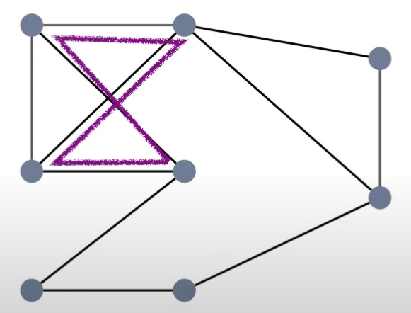|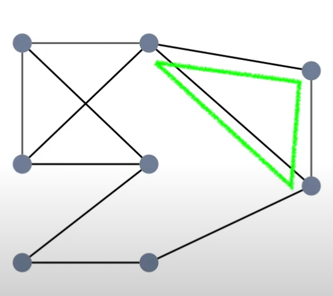|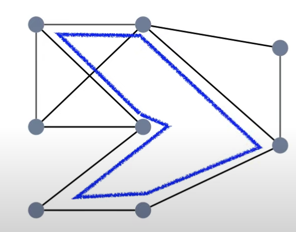|

---


Cycle → sommets

Circuit → arêtes

| Terme       | Usage courant                                       | En graphes                                                  | Exemple        |
| ----------- | --------------------------------------------------- | ----------------------------------------------------------- | --------------------- |
| Cycle   | Suite fermée de sommets (retour au point de départ) | **sommets distincts** visités une fois   | Cycle hamiltonien |
| Circuit | Suite fermée d’arêtes (retour au point de départ)   | **arêtes distinctes** utilisées une fois | Circuit eulérien  |


### **Cycle Hamiltonien**
- Passe une seule fois par chaque sommet
- Reviens au sommet de départ

Il n’existe pas toujours, et il n’y a pas de condition simple (comme pour Euler) pour savoir s’il existe.

*Le cycle hamiltonien minimal resoud le problème du voyageur de commerce (TSP)*

---

### **Circuit eulérien**

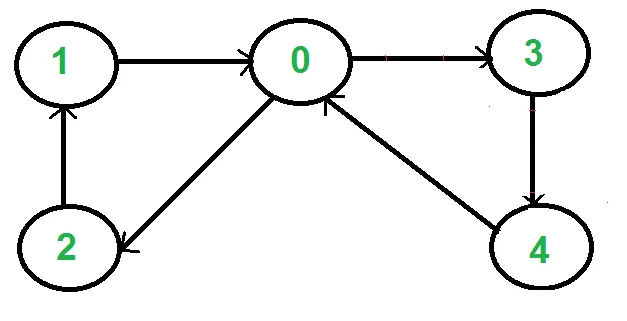

- Passe une fois par chaque arête
- Reviens au sommet de départ

Il existe dans un graphe si et seulement si :
- le graphe est connexe,
- et chaque sommet a un degré pair.

*Idéal pour aider le facteur à distribuer le courrier en passant une seule fois par chaque rue (arête), peu importe s’il repasse par la même intersection (sommet).*

---

### Algo de Prim

Cherche à obtenir un arbre couvrant de poid minimal

1. on part d'un sommet au hazard, et on le considère comme un (petit) arbre
2. on ajoute une arrête (celle qui à un poid minimal) et le sommet qui va avec
3. on ajoute l'arrête qui à un poid minimal
   (parmis toutes celles qui ont une extrémité dans l'arbre et une hors de l'arbre)
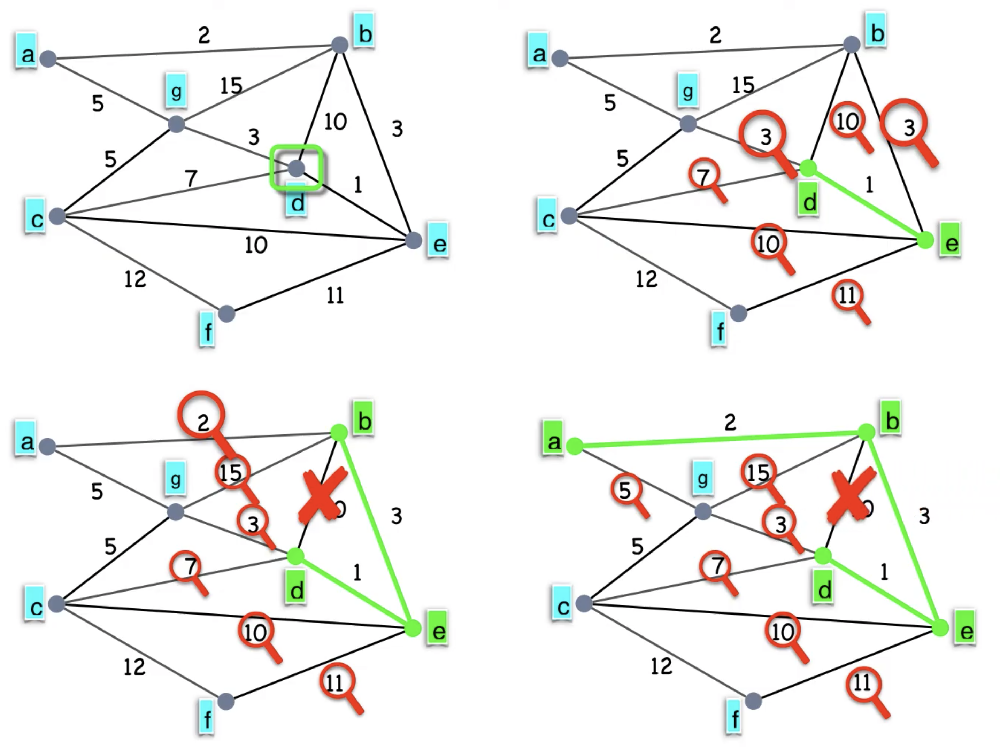
4. **bis repetita**<br>

---

### Algo de cristofides

Christofides sert à approcher le TSP (problème du voyageur de commerce, cycle hamiltonien minimal) dans un graphe métrique.

**Etapes, à partir d'un graph complet** :

🔹 Construire un MST (minimum spanning tree) sur le graphe.

🔹 Identifier les sommets de degré impair dans ce MST.

🔹 Trouver un Minimum Weight Perfect Matching entre ces sommets impairs.

🔹 Ajouter ces arêtes au MST → on obtient un graphe eulérien.

🔹 Trouver un circuit eulérien, puis le convertir en cycle hamiltonien (en sautant les doublons de sommets)

**Résultat** :

- un cycle hamiltonien
- coût ≤ 1,5 × le coût optimal
